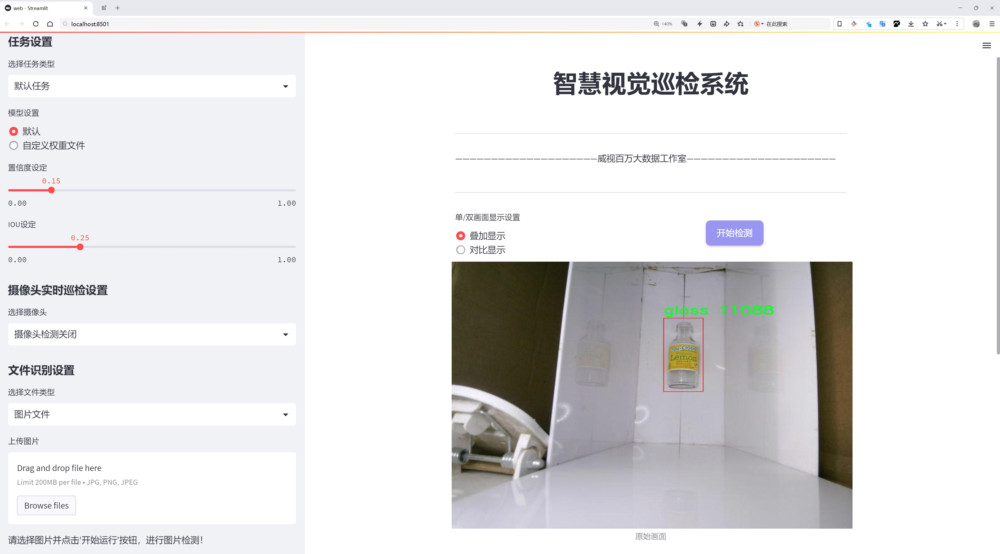
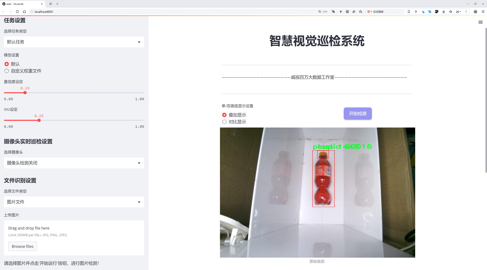
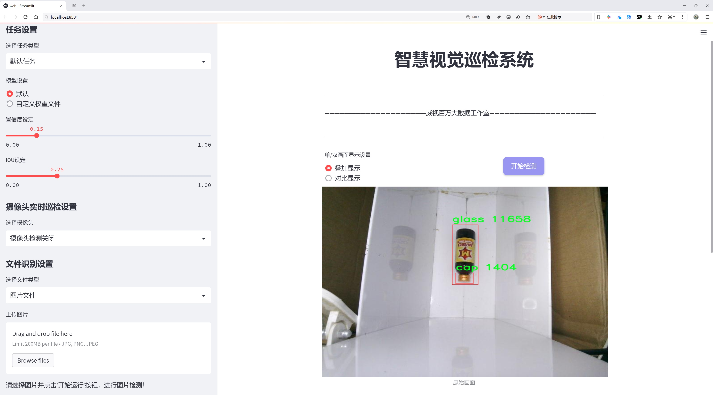
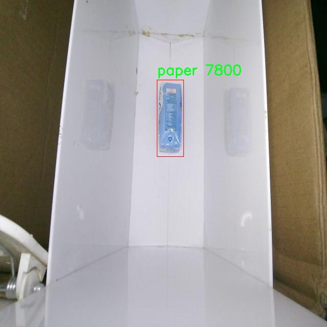
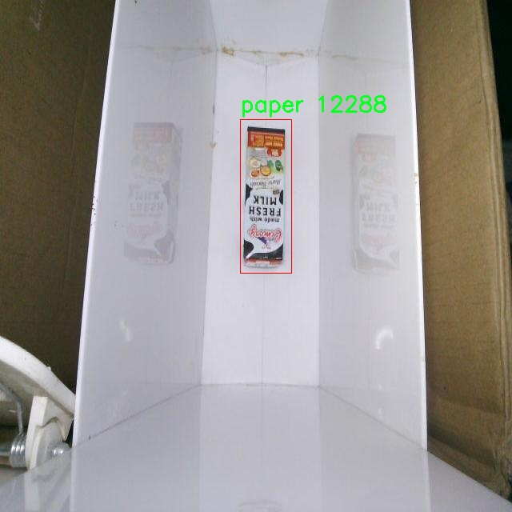
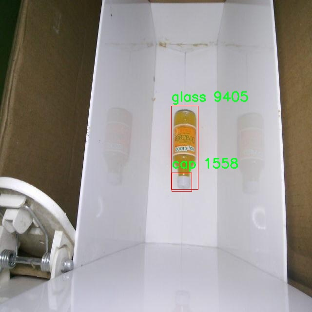
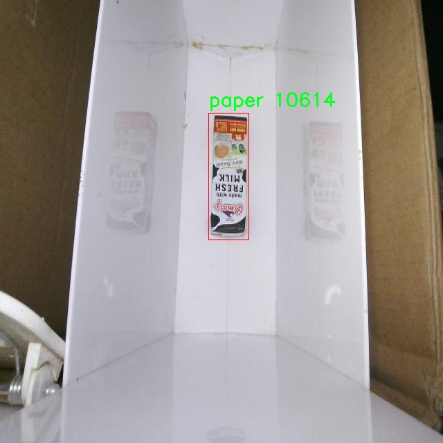
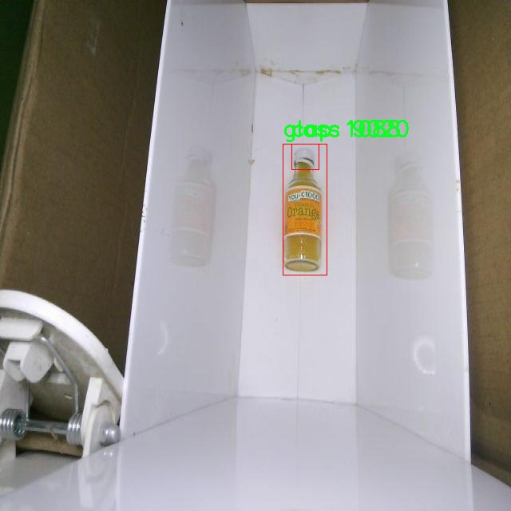

# 垃圾桶垃圾分类检测系统源码分享
 # [一条龙教学YOLOV8标注好的数据集一键训练_70+全套改进创新点发刊_Web前端展示]

### 1.研究背景与意义

项目参考[AAAI Association for the Advancement of Artificial Intelligence](https://gitee.com/qunmasj/projects)

项目来源[AACV Association for the Advancement of Computer Vision](https://kdocs.cn/l/cszuIiCKVNis)

研究背景与意义

随着城市化进程的加快和人口的不断增长，垃圾产生量逐年增加，垃圾分类已成为现代城市管理中亟待解决的重要问题。垃圾分类不仅有助于资源的回收利用，减少环境污染，还能提高公众的环保意识，促进可持续发展。因此，建立高效、准确的垃圾分类检测系统，成为了研究者和工程师们关注的焦点。在这一背景下，基于改进YOLOv8的垃圾桶垃圾分类检测系统应运而生。

YOLO（You Only Look Once）系列模型因其在目标检测任务中的高效性和准确性而受到广泛关注。YOLOv8作为该系列的最新版本，具备了更强的特征提取能力和更快的推理速度，能够在复杂环境中实现实时目标检测。通过对YOLOv8的改进，结合垃圾分类的实际需求，我们可以构建一个更加智能化的垃圾分类检测系统。该系统不仅能够快速识别垃圾桶内的不同垃圾类型，还能为后续的垃圾处理和资源回收提供数据支持。

在本研究中，我们将使用包含1100张图像的数据集，涵盖了五类垃圾：瓶盖、玻璃、金属、纸张和塑料。这一数据集的多样性和丰富性为模型的训练提供了良好的基础。通过对这些类别的深入分析，我们可以更好地理解不同垃圾的特征，从而优化YOLOv8的检测算法，提高分类的准确率。尤其是在实际应用中，垃圾的形态、颜色和大小各异，改进后的YOLOv8模型能够通过学习这些特征，提升其在复杂环境下的鲁棒性。

垃圾分类检测系统的实现，不仅是技术层面的创新，更是对社会环境问题的积极回应。通过自动化的垃圾分类，我们可以有效减少人工分类的工作量，提高分类效率，降低人为错误的发生率。此外，该系统还可以通过数据分析，帮助城市管理者了解垃圾产生的趋势和特征，为政策制定和资源配置提供科学依据。

综上所述，基于改进YOLOv8的垃圾桶垃圾分类检测系统的研究，不仅具有重要的学术价值，还具有广泛的社会意义。通过技术创新推动垃圾分类的智能化，将为城市的可持续发展提供有力支持。未来，我们希望通过进一步的研究和实践，推动这一系统的应用，使其在更多城市和社区中发挥作用，助力实现更高效的垃圾管理和资源循环利用。

### 2.图片演示







##### 注意：由于此博客编辑较早，上面“2.图片演示”和“3.视频演示”展示的系统图片或者视频可能为老版本，新版本在老版本的基础上升级如下：（实际效果以升级的新版本为准）

  （1）适配了YOLOV8的“目标检测”模型和“实例分割”模型，通过加载相应的权重（.pt）文件即可自适应加载模型。

  （2）支持“图片识别”、“视频识别”、“摄像头实时识别”三种识别模式。

  （3）支持“图片识别”、“视频识别”、“摄像头实时识别”三种识别结果保存导出，解决手动导出（容易卡顿出现爆内存）存在的问题，识别完自动保存结果并导出到tempDir中。

  （4）支持Web前端系统中的标题、背景图等自定义修改，后面提供修改教程。

  另外本项目提供训练的数据集和训练教程,暂不提供权重文件（best.pt）,需要您按照教程进行训练后实现图片演示和Web前端界面演示的效果。

### 3.视频演示

[3.1 视频演示](https://www.bilibili.com/video/BV1Fu1yY1EcY/)

### 4.数据集信息展示

##### 4.1 本项目数据集详细数据（类别数＆类别名）

nc: 5
names: ['cap', 'glass', 'metal', 'paper', 'plastic']


##### 4.2 本项目数据集信息介绍

数据集信息展示

在现代城市管理和环境保护的背景下，垃圾分类已成为一项重要的社会责任和环保措施。为了提高垃圾分类的准确性和效率，研究人员开发了基于深度学习的垃圾分类检测系统。本项目所使用的数据集名为“Botol”，该数据集专门用于训练和改进YOLOv8模型，以实现对垃圾桶内垃圾的自动分类。数据集的设计充分考虑了实际应用中的多样性和复杂性，包含了五个主要的垃圾类别，分别是：瓶盖（cap）、玻璃（glass）、金属（metal）、纸张（paper）和塑料（plastic）。这些类别的选择不仅反映了日常生活中常见的垃圾类型，也为后续的垃圾分类工作提供了良好的基础。

“Botol”数据集的类别数量为五个，涵盖了多种材料的垃圾，这使得模型在训练过程中能够学习到不同垃圾的特征和识别方法。每个类别的样本均经过精心挑选和标注，确保数据的准确性和代表性。瓶盖作为一种常见的垃圾，通常由塑料或金属制成，其形状和颜色多样，给分类带来一定的挑战。玻璃垃圾则因其透明性和反光特性，要求模型具备较强的识别能力。金属垃圾的种类繁多，包括铝罐、铁罐等，其表面特征与其他材料有显著差异，模型需要通过学习这些特征来进行有效分类。纸张垃圾则包括报纸、纸箱等，具有较强的可回收性，模型需要识别其纹理和颜色特征。最后，塑料垃圾是现代生活中最常见的垃圾类型之一，其多样的形状和颜色使得分类任务更加复杂。

为了确保“Botol”数据集的有效性，数据采集过程遵循了严格的标准，涵盖了不同环境和条件下的垃圾样本。这些样本不仅来自城市街道、商场和公共场所，还包括家庭垃圾，以确保模型在各种场景下的适应性和鲁棒性。此外，数据集中的样本数量经过精心设计，以保证每个类别的样本均衡，避免模型在训练过程中出现偏倚。

在数据标注方面，采用了先进的标注工具和技术，确保每个样本的标注准确无误。标注过程中，标注人员经过专业培训，能够识别和区分不同类别的垃圾，确保数据集的高质量。这一过程不仅提高了数据集的可靠性，也为后续的模型训练奠定了坚实的基础。

通过使用“Botol”数据集，研究人员能够有效地训练YOLOv8模型，使其在垃圾分类任务中表现出色。该数据集的设计和构建不仅为垃圾分类技术的发展提供了支持，也为实现更高效的垃圾管理和环境保护目标贡献了力量。随着模型的不断优化和数据集的扩展，未来的垃圾分类系统将能够更好地服务于社会，推动可持续发展的进程。











### 5.全套项目环境部署视频教程（零基础手把手教学）

[5.1 环境部署教程链接（零基础手把手教学）](https://www.ixigua.com/7404473917358506534?logTag=c807d0cbc21c0ef59de5)


[5.2 安装Python虚拟环境创建和依赖库安装视频教程链接（零基础手把手教学）](https://www.ixigua.com/7404474678003106304?logTag=1f1041108cd1f708b01a)

### 6.手把手YOLOV8训练视频教程（零基础小白有手就能学会）

[6.1 手把手YOLOV8训练视频教程（零基础小白有手就能学会）](https://www.ixigua.com/7404477157818401292?logTag=d31a2dfd1983c9668658)


按照上面的训练视频教程链接加载项目提供的数据集，运行train.py即可开始训练



     Epoch   gpu_mem       box       obj       cls    labels  img_size
     1/200     20.8G   0.01576   0.01955  0.007536        22      1280: 100%|██████████| 849/849 [14:42<00:00,  1.04s/it]
               Class     Images     Labels          P          R     mAP@.5 mAP@.5:.95: 100%|██████████| 213/213 [01:14<00:00,  2.87it/s]
                 all       3395      17314      0.994      0.957      0.0957      0.0843

     Epoch   gpu_mem       box       obj       cls    labels  img_size
     2/200     20.8G   0.01578   0.01923  0.007006        22      1280: 100%|██████████| 849/849 [14:44<00:00,  1.04s/it]
               Class     Images     Labels          P          R     mAP@.5 mAP@.5:.95: 100%|██████████| 213/213 [01:12<00:00,  2.95it/s]
                 all       3395      17314      0.996      0.956      0.0957      0.0845

     Epoch   gpu_mem       box       obj       cls    labels  img_size
     3/200     20.8G   0.01561    0.0191  0.006895        27      1280: 100%|██████████| 849/849 [10:56<00:00,  1.29it/s]
               Class     Images     Labels          P          R     mAP@.5 mAP@.5:.95: 100%|███████   | 187/213 [00:52<00:00,  4.04it/s]
                 all       3395      17314      0.996      0.957      0.0957      0.0845


### 7.70+种全套YOLOV8创新点代码加载调参视频教程（一键加载写好的改进模型的配置文件）

[7.1 70+种全套YOLOV8创新点代码加载调参视频教程（一键加载写好的改进模型的配置文件）](https://www.ixigua.com/7404478314661806627?logTag=29066f8288e3f4eea3a4)

### 8.70+种全套YOLOV8创新点原理讲解（非科班也可以轻松写刊发刊，V10版本正在科研待更新）

#### 由于篇幅限制，每个创新点的具体原理讲解就不一一展开，具体见下列网址中的创新点对应子项目的技术原理博客网址【Blog】：


[8.1 70+种全套YOLOV8创新点原理讲解链接](https://gitee.com/qunmasj/good)

#### 部分改进原理讲解(完整的改进原理见上图和技术博客链接)
### 深度学习基础
卷积神经网络通过使用具有共享参数的卷积运算显著降低了模型的计算开销和复杂性。在LeNet、AlexNet和VGG等经典网络的驱动下，卷积神经网络现在已经建立了一个完整的系统，并在深度学习领域形成了先进的卷积神经网络模型。

感受野注意力卷积RFCBAMConv的作者在仔细研究了卷积运算之后获得了灵感。对于分类、目标检测和语义分割任务，一方面，图像中不同位置的对象的形状、大小、颜色和分布是可变的。在卷积操作期间，卷积核在每个感受野中使用相同的参数来提取信息，而不考虑来自不同位置的差分信息。这限制了网络的性能，这已经在最近的许多工作中得到了证实。

另一方面，卷积运算没有考虑每个特征的重要性，这进一步影响了提取特征的有效性，并最终限制了模型的性能。此外，注意力机制允许模型专注于重要特征，这可以增强特征提取的优势和卷积神经网络捕获详细特征信息的能力。因此，注意力机制在深度学习中得到了广泛的应用，并成功地应用于各个领域。

通过研究卷积运算的内在缺陷和注意力机制的特点，作者认为现有的空间注意力机制从本质上解决了卷积运算的参数共享问题，但仍局限于对空间特征的认知。对于较大的卷积核，现有的空间注意力机制并没有完全解决共享参数的问题。此外，他们无法强调感受野中每个特征的重要性，例如现有的卷积块注意力模块（CBAM）和 Coordinate注意力（CA）。

因此，[参考该博客提出了一种新的感受野注意力机制（RFA）](https://qunmasj.com)，它完全解决了卷积核共享参数的问题，并充分考虑了感受野中每个特征的重要性。通过RFA设计的卷积运算（RFAConv）是一种新的卷积运算，可以取代现有神经网络中的标准卷积运算。RFAConv通过添加一些参数和计算开销来提高网络性能。

大量关于Imagnet-1k、MS COCO和VOC的实验已经证明了RFAConv的有效性。作为一种由注意力构建的新型卷积运算，它超过了由CAM、CBAM和CA构建的卷积运算（CAMConv、CBAMConv、CAConv）以及标准卷积运算。

此外，为了解决现有方法提取感受野特征速度慢的问题，提出了一种轻量级操作。在构建RFAConv的过程中，再次设计了CA和CBAM的升级版本，并进行了相关实验。作者认为当前的空间注意力机制应该将注意力放在感受野空间特征上，以促进当前空间注意力机制的发展，并再次增强卷积神经网络架构的优势。


### 卷积神经网络架构
出色的神经网络架构可以提高不同任务的性能。卷积运算作为卷积神经网络的一种基本运算，推动了人工智能的发展，并为车辆检测、无人机图像、医学等先进的网络模型做出了贡献。He等人认为随着网络深度的增加，该模型将变得难以训练并产生退化现象，因此他们提出了残差连接来创新卷积神经网络架构的设计。Huang等人通过重用特征来解决网络梯度消失问题，增强了特征信息，他们再次创新了卷积神经网络架构。

通过对卷积运算的详细研究，Dai等人认为，具有固定采样位置的卷积运算在一定程度上限制了网络的性能，因此提出了Deformable Conv，通过学习偏移来改变卷积核的采样位置。在Deformable Conv的基础上，再次提出了Deformable Conv V2和Deformable Conv V3，以提高卷积网络的性能。

Zhang等人注意到，组卷积可以减少模型的参数数量和计算开销。然而，少于组内信息的交互将影响最终的网络性能。1×1的卷积可以与信息相互作用。然而，这将带来更多的参数和计算开销，因此他们提出了无参数的“通道Shuffle”操作来与组之间的信息交互。

Ma等人通过实验得出结论，对于参数较少的模型，推理速度不一定更快，对于计算量较小的模型，推理也不一定更快。经过仔细研究提出了Shufflenet V2。

YOLO将输入图像划分为网格，以预测对象的位置和类别。经过不断的研究，已经提出了8个版本的基于YOLO的目标检测器，如YOLOv5、YOLOv7、YOLOv8等。上述卷积神经网络架构已经取得了巨大的成功。然而，它们并没有解决提取特征过程中的参数共享问题。本文的工作从注意力机制开始，从一个新的角度解决卷积参数共享问题。

### 注意力机制
注意力机制被用作一种提高网络模型性能的技术，使其能够专注于关键特性。注意力机制理论已经在深度学习中建立了一个完整而成熟的体系。Hu等人提出了一种Squeeze-and-Excitation（SE）块，通过压缩特征来聚合全局通道信息，从而获得与每个通道对应的权重。Wang等人认为，当SE与信息交互时，单个通道和权重之间的对应关系是间接的，因此设计了高效通道注Efficient Channel Attention力（ECA），并用自适应kernel大小的一维卷积取代了SE中的全连接（FC）层。Woo等人提出了卷积块注意力模块（CBAM），它结合了通道注意力和空间注意力。作为一个即插即用模块，它可以嵌入卷积神经网络中，以提高网络性能。

尽管SE和CBAM已经提高了网络的性能。Hou等人仍然发现压缩特征在SE和CBAM中丢失了太多信息。因此，他们提出了轻量级Coordinate注意力（CA）来解决SE和CBAM中的问题。Fu等人计了一个空间注意力模块和通道注意力模块，用于扩展全卷积网络（FCN），分别对空间维度和通道维度的语义相关性进行建模。Zhang等人在通道上生成不同尺度的特征图，以建立更有效的通道注意力机制。

本文从一个新的角度解决了标准卷积运算的参数共享问题。这就是将注意力机制结合起来构造卷积运算。尽管目前的注意力机制已经获得了良好的性能，但它们仍然没有关注感受野的空间特征。因此，设计了具有非共享参数的RFA卷积运算，以提高网络的性能。


#### 回顾标准卷积
以标准卷积运算为基础构建卷积神经网络，通过共享参数的滑动窗口提取特征信息，解决了全连接层构建的神经网络的固有问题（即参数数量大、计算开销高）。

设表示输入特征图，其中、和分别表示特征图的通道数、高度和宽度。为了能够清楚地展示卷积核提取特征信息的过程，以为例。提取每个感受野slider的特征信息的卷积运算可以表示如下：


这里，表示在每次卷积slider操作之后获得的值，表示在每个slider内的相应位置处的像素值。表示卷积核，表示卷积核中的参数数量，表示感受野slider的总数。

可以看出，每个slider内相同位置的特征共享相同的参数。因此，标准的卷积运算无法感知不同位置带来的差异信息，这在一定程度上限制了卷积神经网络的性能。

#### 回顾空间注意力
目前，空间注意力机制使用通过学习获得的注意力图来突出每个特征的重要性。与上一节类似，以为例。突出关键特征的空间注意力机制可以简单地表达如下：


这里，表示在加权运算之后获得的值。和分别表示输入特征图和学习注意力图在不同位置的值，是输入特征图的高度和宽度的乘积，表示像素值的总数。一般来说，整个过程可以简单地表示在图1中。


#### 空间注意力与标准卷积
众所周知，将注意力机制引入卷积神经网络可以提高网络的性能。通过标准的卷积运算和对现有空间注意力机制的仔细分析。作者认为空间注意力机制本质上解决了卷积神经网络的固有缺点，即共享参数的问题。

目前，该模型最常见的卷积核大小为1×1和3×3。引入空间注意力机制后用于提取特征的卷积操作是1×1或3×3卷积操作。这个过程可以直观地显示出来。空间注意力机制被插入到1×1卷积运算的前面。通过注意力图对输入特征图进行加权运算（Re-weight“×”），最后通过1×1卷积运算提取感受野的slider特征信息。

整个过程可以简单地表示如下：


 

这里，卷积核仅表示一个参数值。如果将的值作为一个新的卷积核参数，那么有趣的是，通过1×1卷积运算提取特征时的参数共享问题得到了解决。然而，空间注意力机制的传说到此结束。当空间注意力机制被插入到3×3卷积运算的前面时。具体情况如下：


如上所述，如果取的值。作为一种新的卷积核参数，上述方程完全解决了大规模卷积核的参数共享问题。然而，最重要的一点是，卷积核在每个感受野slider中提取将共享部分特征的特征。换句话说，在每个感受野slider内都会有重叠。

经过仔细分析发现，，…，空间注意力图的权重在每个slider内共享。因此，空间注意机制不能解决大规模卷积核共享参数的问题，因为它们不注意感受野的空间特征。在这种情况下，空间注意力机制是有限的。
#### 创新空间注意力与标准卷积
RFA是为了解决空间注意力机制问题而提出的，创新了空间注意力。使用与RFA相同的思想，一系列空间注意力机制可以再次提高性能。RFA设计的卷积运算可以被视为一种轻量级的即插即用模块，以取代标准卷积，从而提高卷积神经网络的性能。因此，作者认为空间注意力机制和标准卷积在未来将有一个新的春天。

感受野的空间特征：

现在给出感受野空间特征的定义。它是专门为卷积核设计的，并根据kernel大小动态生成，如图2所示，以3×3卷积核为例。


在图2中，“空间特征”表示原始特征图，等于空间特征。“感受野空间特征”表示变换后的特征，该特征由每个感受野slider滑块组成，并且不重叠。也就是说，“感受野空间特征”中的每个3×3大小的slider表示提取原始3×3卷积特征时所有感觉野slider的特征。

#### 感受野注意力卷积(RFA):

关于感受野空间特征，该博客的作者提出了感受野注意（RFA），它不仅强调了感受野slider内各种特征的重要性，而且还关注感受野空间特性，以彻底解决卷积核参数共享的问题。感受野空间特征是根据卷积核的大小动态生成的，因此，RFA是卷积的固定组合，不能脱离卷积运算的帮助，卷积运算同时依赖RFA来提高性能。

因此，作者提出了感受野注意力卷积（RFAConv）。具有3×3大小卷积核的RFAConv的总体结构如图3所示。


目前，提取感受野特征最常用的方法速度较慢，因此经过不断探索提出了一种快速的方法，通过分组卷积来取代原来的方法。

具体来说，根据感受野大小，使用相应的组卷积大小来动态生成展开特征。尽管与原始的无参数方法（如Pytorch提供的nn.Unfld()）相比，该方法添加了一些参数，但速度要快得多。

注意：正如在上一节中提到的，当原始的3×3卷积核提取特征时，感受野空间特征中的每个3×3大小的窗口表示所有感受野滑块的特征。但在快速分组卷积提取感受野特征后，由于原始方法太慢，它们会被映射到新的特征中。

最近的一些工作已经证明信息交互可以提高网络性能。类似地，对于RFAConv，与感受野特征信息交互以学习注意力图可以提高网络性能，但与每个感受野特征交互将带来额外的计算开销。为了确保少量的计算开销和参数数量，通过探索使用AvgPool池化每个感受野特征的全局信息，然后通过1×1组卷积运算与信息交互。最后，softmax用于强调感受野特征中每个特征的重要性。通常，RFA的计算可以表示为：


表示分组卷积，表示卷积核的大小，代表规范化，表示输入特征图，是通过将注意力图与变换的感受野空间特征相乘而获得的。

与CBAM和CA不同，RFA可以为每个感受野特征生成注意力图。标准卷积受到卷积神经网络性能的限制，因为共享参数的卷积运算对位置带来的差异信息不敏感。RFA完全可以解决这个问题，具体细节如下：


由于RFA获得的特征图是“调整形状”后不重叠的感受野空间特征，因此通过池化每个感受野滑块的特征信息来学习学习的注意力图。换句话说，RFA学习的注意力图不再在每个感受野slider内共享，并且是有效的。这完全解决了现有的CA和CBAM对大尺寸kernel的注意力机制中的参数共享问题。

同时，RFA给标准卷积核带来了相当大的好处，但调整形状后，特征的高度和宽度是k倍，需要进行k×k的stride卷积运算，才能提取特征信息。RFAConv创新了标准卷积运算。

此外，空间注意力机制将得到升级，因为作者认为现有的空间注意力机制应该专注于感受野空间特征，以提高网络的性能。众所周知，基于自注意力机制的网络模型取得了巨大的成功，因为它解决了卷积参数共享的问题，并对远程信息进行了建模，但基于自注意力机理的方法给模型带来了巨大的计算开销和复杂性。作者认为通过将一些现有空间注意力机制的注意力放在感受野空间特征中，它以轻量级的方式解决了自注意力机制的问题。

答案如下：

将关注感受野空间特征的空间注意力与卷积相匹配，完全解决了卷积参数共享的问题；

当前的空间注意力机制本身具有考虑远距离信息的特点，它们通过全局平均池化或全局最大池化来获得全局信息，这在一定程度上考虑了远距离信息。


为此，作者设计了一种新的CBAM和CA，称为RFACBAM和RFACA，它专注于感受野的空间特征。与RFA类似，使用stride为k的k×k的最终卷积运算来提取特征信息，具体结构如图4和图5所示，将这2种新的卷积方法称为RFCBAMConv和RFCAConv。比较原始的CBAM，使用SE注意力来代替RFCBAM中的CAM。因为这样可以减少计算开销。


此外，在RFCBAM中，通道和空间注意力不是在单独的步骤中执行的，因为通道和空间注意力是同时加权的，从而允许在每个通道上获得的注意力图是不同的。


### 9.系统功能展示（检测对象为举例，实际内容以本项目数据集为准）

图9.1.系统支持检测结果表格显示

  图9.2.系统支持置信度和IOU阈值手动调节

  图9.3.系统支持自定义加载权重文件best.pt(需要你通过步骤5中训练获得)

  图9.4.系统支持摄像头实时识别

  图9.5.系统支持图片识别

  图9.6.系统支持视频识别

  图9.7.系统支持识别结果文件自动保存

  图9.8.系统支持Excel导出检测结果数据


### 10.原始YOLOV8算法原理

原始YOLOv8算法原理

YOLOv8算法是目标检测领域的一项重要进展，基于YOLOv5的架构进行了深度优化与升级，旨在提升检测精度和速度，同时保持模型的轻量化特性。该算法的核心思想在于实时性与准确性的平衡，能够在各种应用场景中有效地识别和定位目标物体。YOLOv8不仅继承了前代YOLO系列的优良特性，还引入了一系列创新设计，使其在复杂环境下的表现更加出色。

首先，YOLOv8在数据预处理阶段采用了YOLOv5的增强策略，包括马赛克增强、混合增强、空间扰动和颜色扰动等。这些增强手段旨在提高模型的泛化能力，减少过拟合现象，从而使模型在面对不同场景和光照条件时，依然能够保持较高的检测性能。通过这些预处理手段，YOLOv8能够有效地扩展训练数据集的多样性，使得模型在训练过程中获得更为丰富的特征表达。

在网络结构方面，YOLOv8对骨干特征提取网络进行了显著的改进。原有的C3模块被新的C2f模块所替代，C2f模块通过引入更多的分支结构，增强了特征提取的能力。这种设计不仅提高了梯度回传的效率，还使得模型在特征提取过程中能够更好地捕捉到细微的特征变化。C2f模块的深度和结构灵活性，使得YOLOv8能够在不同规模的模型中进行有效的参数调整，适应各种应用需求。

YOLOv8的特征融合网络同样是其重要组成部分，采用了FPN（特征金字塔网络）与PAN（路径聚合网络）的结合结构。FPN能够有效地融合多尺度特征信息，而PAN则通过路径聚合进一步增强了特征的传递效率。在此基础上，YOLOv8引入了BiFPN（双向特征金字塔网络），其核心思想是通过高效的双向跨尺度连接和加权特征融合，提升模型对不同尺度特征信息的提取速度。这种设计不仅提高了模型的准确性，还有效地减少了计算资源的消耗，使得YOLOv8在实时检测任务中表现更加优异。

在检测头的设计上，YOLOv8采用了解耦头结构，这一创新源于YOLOX的设计理念。与传统的耦合头不同，解耦头将分类和定位任务分开处理，通过两条并行的分支分别提取类别特征和位置特征。这样的设计使得模型在处理复杂场景时，能够更清晰地分辨目标的类别和位置，从而提高了检测的准确性和鲁棒性。

标签分配策略的改进也是YOLOv8的一大亮点。YOLOv8采用了动态标签分配策略，避免了依赖于数据集的聚类候选框方法。这种策略通过使用目标框和目标分数，优化了正负样本的匹配过程。与YOLOX使用的SimOTA策略不同，YOLOv8借鉴了YOLOv6的TOOD策略，主要通过类别损失和位置损失的结合来进行优化。具体而言，YOLOv8引入了Varifocal Loss（VFL Loss）作为分类损失，CIoU Loss与DFL Loss的结合则用于回归损失的计算。这种损失函数的设计使得模型在训练过程中能够更好地关注高质量的正样本，同时降低负样本对整体损失的影响，从而提升了模型的学习效率。

总的来说，YOLOv8算法通过一系列创新设计，成功地在目标检测领域实现了性能的提升。其轻量化的结构设计和高效的特征提取能力，使得YOLOv8在实时检测任务中表现出色，能够满足现代应用对速度和准确性的双重需求。随着YOLOv8的广泛应用，预计其将在自动驾驶、安防监控、智能制造等多个领域发挥重要作用，推动目标检测技术的进一步发展。


### 11.项目核心源码讲解（再也不用担心看不懂代码逻辑）

#### 11.1 ui.py

以下是对代码的核心部分进行保留和详细注释的版本：

```python
import sys
import subprocess

def run_script(script_path):
    """
    使用当前 Python 环境运行指定的脚本。

    Args:
        script_path (str): 要运行的脚本路径

    Returns:
        None
    """
    # 获取当前 Python 解释器的路径
    python_path = sys.executable

    # 构建运行命令，使用 streamlit 运行指定的脚本
    command = f'"{python_path}" -m streamlit run "{script_path}"'

    # 执行命令并等待其完成
    result = subprocess.run(command, shell=True)
    
    # 检查命令执行的返回码，非零表示出错
    if result.returncode != 0:
        print("脚本运行出错。")

# 实例化并运行应用
if __name__ == "__main__":
    # 指定要运行的脚本路径
    script_path = "web.py"  # 假设脚本在当前目录下

    # 调用函数运行脚本
    run_script(script_path)
```

### 代码分析与注释

1. **导入模块**：
   - `sys`：用于访问与 Python 解释器相关的变量和函数。
   - `subprocess`：用于创建新进程、连接到它们的输入/输出/错误管道，并获得它们的返回码。

2. **`run_script` 函数**：
   - 该函数接收一个脚本路径作为参数，并在当前 Python 环境中运行该脚本。
   - 使用 `sys.executable` 获取当前 Python 解释器的路径，以确保脚本在正确的环境中运行。
   - 构建命令字符串，使用 `streamlit` 模块运行指定的脚本。
   - 使用 `subprocess.run` 执行命令，并通过 `shell=True` 允许命令在 shell 中执行。
   - 检查命令的返回码，如果返回码不为零，则输出错误信息。

3. **主程序块**：
   - 使用 `if __name__ == "__main__":` 确保只有在直接运行该脚本时才会执行以下代码。
   - 指定要运行的脚本路径（在此示例中为 `web.py`）。
   - 调用 `run_script` 函数来执行指定的脚本。

通过这些注释，可以清晰地理解代码的功能和逻辑。

这个文件是一个 Python 脚本，主要用于运行一个名为 `web.py` 的脚本。它首先导入了一些必要的模块，包括 `sys`、`os` 和 `subprocess`，以及一个自定义的 `abs_path` 函数，这个函数来自于 `QtFusion.path` 模块，可能用于获取文件的绝对路径。

在脚本中，定义了一个名为 `run_script` 的函数，该函数接收一个参数 `script_path`，表示要运行的脚本的路径。函数内部首先获取当前 Python 解释器的路径，这通过 `sys.executable` 实现。接着，构建一个命令字符串，该命令用于通过 `streamlit` 运行指定的脚本。命令的格式是 `"{python_path}" -m streamlit run "{script_path}"`，其中 `python_path` 是当前 Python 解释器的路径，`script_path` 是传入的脚本路径。

然后，使用 `subprocess.run` 方法执行这个命令，`shell=True` 参数表示在一个新的 shell 中执行命令。执行后，检查返回的结果，如果返回码不为 0，表示脚本运行出错，程序会打印出“脚本运行出错。”的提示信息。

在文件的最后部分，使用 `if __name__ == "__main__":` 来确保当这个脚本作为主程序运行时，以下代码才会被执行。这里指定了要运行的脚本路径为 `web.py`，并调用 `run_script` 函数来执行这个脚本。

总的来说，这个脚本的功能是方便地运行一个 Streamlit 应用，具体是通过调用 `web.py` 脚本来实现的。

#### 11.2 70+种YOLOv8算法改进源码大全和调试加载训练教程（非必要）\ultralytics\utils\callbacks\neptune.py

以下是经过简化和注释的核心代码部分：

```python
# 导入必要的库
from ultralytics.utils import LOGGER, SETTINGS, TESTS_RUNNING

# 尝试导入NeptuneAI库并进行基本的配置检查
try:
    assert not TESTS_RUNNING  # 确保不是在进行测试
    assert SETTINGS['neptune'] is True  # 确保Neptune集成已启用
    import neptune
    from neptune.types import File

    assert hasattr(neptune, '__version__')  # 检查Neptune的版本

    run = None  # 初始化NeptuneAI实验记录实例

except (ImportError, AssertionError):
    neptune = None  # 如果导入失败，则将neptune设置为None


def _log_scalars(scalars, step=0):
    """将标量数据记录到NeptuneAI实验记录器中。"""
    if run:  # 如果Neptune已初始化
        for k, v in scalars.items():  # 遍历标量字典
            run[k].append(value=v, step=step)  # 记录标量值和步骤


def _log_images(imgs_dict, group=''):
    """将图像记录到NeptuneAI实验记录器中。"""
    if run:  # 如果Neptune已初始化
        for k, v in imgs_dict.items():  # 遍历图像字典
            run[f'{group}/{k}'].upload(File(v))  # 上传图像文件


def on_pretrain_routine_start(trainer):
    """在训练例程开始之前调用的回调函数。"""
    try:
        global run
        # 初始化Neptune运行
        run = neptune.init_run(project=trainer.args.project or 'YOLOv8', name=trainer.args.name, tags=['YOLOv8'])
        # 记录超参数配置
        run['Configuration/Hyperparameters'] = {k: '' if v is None else v for k, v in vars(trainer.args).items()}
    except Exception as e:
        LOGGER.warning(f'WARNING ⚠️ NeptuneAI安装但未正确初始化，未记录此运行。 {e}')


def on_train_epoch_end(trainer):
    """每个训练周期结束时调用的回调函数。"""
    _log_scalars(trainer.label_loss_items(trainer.tloss, prefix='train'), trainer.epoch + 1)  # 记录训练损失
    _log_scalars(trainer.lr, trainer.epoch + 1)  # 记录学习率
    if trainer.epoch == 1:  # 如果是第一个周期
        # 记录训练过程中的图像
        _log_images({f.stem: str(f) for f in trainer.save_dir.glob('train_batch*.jpg')}, 'Mosaic')


def on_train_end(trainer):
    """训练结束时调用的回调函数。"""
    if run:  # 如果Neptune已初始化
        # 记录最终结果和模型
        files = [
            'results.png', 'confusion_matrix.png', 'confusion_matrix_normalized.png',
            *(f'{x}_curve.png' for x in ('F1', 'PR', 'P', 'R'))]
        files = [(trainer.save_dir / f) for f in files if (trainer.save_dir / f).exists()]  # 过滤存在的文件
        for f in files:
            _log_plot(title=f.stem, plot_path=f)  # 记录图表
        # 记录最终模型
        run[f'weights/{trainer.args.name or trainer.args.task}/{str(trainer.best.name)}'].upload(File(str(trainer.best)))


# 定义回调函数字典
callbacks = {
    'on_pretrain_routine_start': on_pretrain_routine_start,
    'on_train_epoch_end': on_train_epoch_end,
    'on_train_end': on_train_end} if neptune else {}
```

### 代码说明：
1. **导入库**：导入必要的库和模块，包括`ultralytics`和`neptune`。
2. **Neptune初始化**：尝试初始化Neptune并进行基本的配置检查，确保可以进行实验记录。
3. **日志记录函数**：
   - `_log_scalars`：记录标量数据（如损失和学习率）。
   - `_log_images`：记录图像数据（如训练和验证过程中的图像）。
4. **回调函数**：
   - `on_pretrain_routine_start`：在训练开始前初始化Neptune运行并记录超参数。
   - `on_train_epoch_end`：在每个训练周期结束时记录损失和学习率，并在第一个周期记录图像。
   - `on_train_end`：在训练结束时记录最终结果和模型文件。
5. **回调字典**：根据Neptune是否可用定义回调函数的字典。

这个程序文件是一个用于YOLOv8算法的NeptuneAI集成的回调函数模块。NeptuneAI是一个实验管理工具，能够帮助用户记录和可视化机器学习实验的各种指标和结果。文件的主要功能是定义一些回调函数，这些函数在训练过程中的特定时刻被调用，以便将训练过程中的数据和结果记录到NeptuneAI上。

首先，文件中导入了一些必要的模块和库，包括Ultralytics的日志记录器和设置。接着，尝试导入Neptune库，并进行一些基本的检查，例如确认Neptune集成是否启用以及Neptune库的版本。这些检查确保了在没有正确安装Neptune的情况下不会引发错误。

接下来，定义了一些私有函数用于记录不同类型的数据。`_log_scalars`函数用于记录标量数据，例如损失值和学习率；`_log_images`函数用于记录图像数据，比如训练过程中的样本图像；`_log_plot`函数用于记录绘图数据，例如训练结果的可视化图表。

然后，定义了一系列回调函数，这些函数会在训练过程中的特定事件发生时被调用。例如，`on_pretrain_routine_start`函数在训练开始前被调用，用于初始化Neptune的运行实例并记录超参数配置；`on_train_epoch_end`函数在每个训练周期结束时被调用，记录训练损失和学习率，并在第一个周期结束时记录训练图像；`on_fit_epoch_end`函数在每个训练和验证周期结束时被调用，记录模型信息和指标；`on_val_end`函数在验证结束时被调用，记录验证图像；`on_train_end`函数在训练结束时被调用，记录最终结果和模型权重。

最后，所有的回调函数被组织成一个字典，只有在Neptune库可用的情况下才会被定义。这个模块的设计使得用户能够方便地将YOLOv8训练过程中的重要信息记录到NeptuneAI中，从而实现更好的实验管理和结果分析。

#### 11.3 code\ultralytics\nn\__init__.py

```python
# 导入必要的任务模块
from .tasks import (
    BaseModel,           # 基础模型类
    ClassificationModel, # 分类模型类
    DetectionModel,      # 检测模型类
    SegmentationModel,   # 分割模型类
    attempt_load_one_weight, # 尝试加载单个权重
    attempt_load_weights,     # 尝试加载多个权重
    guess_model_scale,        # 猜测模型的尺度
    guess_model_task,         # 猜测模型的任务类型
    parse_model,              # 解析模型
    torch_safe_load,          # 安全加载PyTorch模型
    yaml_model_load,          # 从YAML文件加载模型
)

# 定义模块的公开接口
__all__ = (
    "attempt_load_one_weight", # 公开加载单个权重的函数
    "attempt_load_weights",     # 公开加载多个权重的函数
    "parse_model",              # 公开解析模型的函数
    "yaml_model_load",          # 公开从YAML文件加载模型的函数
    "guess_model_task",         # 公开猜测模型任务的函数
    "guess_model_scale",        # 公开猜测模型尺度的函数
    "torch_safe_load",          # 公开安全加载PyTorch模型的函数
    "DetectionModel",           # 公开检测模型类
    "SegmentationModel",        # 公开分割模型类
    "ClassificationModel",      # 公开分类模型类
    "BaseModel",                # 公开基础模型类
)
```

### 代码注释说明
1. **导入模块**：从当前包的 `tasks` 模块中导入多个模型类和函数，这些是构建和操作不同类型模型所需的核心组件。
   
2. **模型类**：
   - `BaseModel`：基础模型类，其他模型类可能会继承自此类。
   - `ClassificationModel`：用于图像分类的模型类。
   - `DetectionModel`：用于目标检测的模型类。
   - `SegmentationModel`：用于图像分割的模型类。

3. **函数**：
   - `attempt_load_one_weight`：尝试加载单个模型权重，可能用于初始化模型。
   - `attempt_load_weights`：尝试加载多个模型权重，适用于需要加载多个权重的情况。
   - `guess_model_scale`：根据输入数据或模型特征猜测模型的尺度。
   - `guess_model_task`：根据模型特征猜测模型的任务类型（如分类、检测等）。
   - `parse_model`：解析模型结构，可能用于模型的构建或分析。
   - `torch_safe_load`：安全地加载PyTorch模型，避免潜在的错误。
   - `yaml_model_load`：从YAML配置文件中加载模型配置。

4. **公开接口**：`__all__` 变量定义了模块的公开接口，只有在 `from module import *` 时，列出的名称会被导入。这有助于控制模块的可见性和避免命名冲突。

这个程序文件是Ultralytics YOLO项目的一部分，主要用于定义和导入与模型相关的功能和类。文件开头包含了一个版权声明，说明该代码遵循AGPL-3.0许可证。

在文件中，通过相对导入的方式，从`tasks`模块中引入了一系列的类和函数。这些类包括`BaseModel`、`ClassificationModel`、`DetectionModel`和`SegmentationModel`，它们分别代表不同类型的模型架构，适用于基础模型、分类、检测和分割任务。此外，还引入了一些与模型加载和解析相关的函数，如`attempt_load_one_weight`、`attempt_load_weights`、`guess_model_scale`、`guess_model_task`、`parse_model`、`torch_safe_load`和`yaml_model_load`。

最后，文件通过`__all__`变量定义了一个公共接口，列出了可以被外部模块导入的类和函数。这种做法有助于控制模块的可见性，确保只有必要的部分被暴露给使用者，从而提高代码的封装性和可维护性。通过这种方式，用户可以方便地使用YOLO模型相关的功能，而不需要了解内部实现的细节。

#### 11.4 code\ultralytics\engine\results.py

以下是代码中最核心的部分，并附上详细的中文注释：

```python
class BaseTensor(SimpleClass):
    """基础张量类，提供额外的方法以便于操作和设备管理。"""

    def __init__(self, data, orig_shape) -> None:
        """
        初始化 BaseTensor，包含数据和原始形状。

        参数:
            data (torch.Tensor | np.ndarray): 预测结果，例如边界框、掩码和关键点。
            orig_shape (tuple): 图像的原始形状。
        """
        assert isinstance(data, (torch.Tensor, np.ndarray))  # 确保数据是张量或数组
        self.data = data  # 存储数据
        self.orig_shape = orig_shape  # 存储原始形状

    @property
    def shape(self):
        """返回数据张量的形状。"""
        return self.data.shape

    def cpu(self):
        """返回在 CPU 内存上的张量副本。"""
        return self if isinstance(self.data, np.ndarray) else self.__class__(self.data.cpu(), self.orig_shape)

    def numpy(self):
        """返回张量的 numpy 数组副本。"""
        return self if isinstance(self.data, np.ndarray) else self.__class__(self.data.numpy(), self.orig_shape)

    def cuda(self):
        """返回在 GPU 内存上的张量副本。"""
        return self.__class__(torch.as_tensor(self.data).cuda(), self.orig_shape)

    def to(self, *args, **kwargs):
        """返回具有指定设备和数据类型的张量副本。"""
        return self.__class__(torch.as_tensor(self.data).to(*args, **kwargs), self.orig_shape)

    def __len__(self):  # 重写 len(results)
        """返回数据张量的长度。"""
        return len(self.data)

    def __getitem__(self, idx):
        """返回指定索引的数据张量的 BaseTensor 对象。"""
        return self.__class__(self.data[idx], self.orig_shape)


class Results(SimpleClass):
    """
    存储和操作推理结果的类。

    参数:
        orig_img (numpy.ndarray): 原始图像的 numpy 数组。
        path (str): 图像文件的路径。
        names (dict): 类别名称的字典。
        boxes (torch.tensor, optional): 每个检测的边界框坐标的 2D 张量。
        masks (torch.tensor, optional): 检测掩码的 3D 张量，每个掩码是一个二进制图像。
        probs (torch.tensor, optional): 每个类别的概率的 1D 张量。
        keypoints (List[List[float]], optional): 每个对象的检测关键点的列表。

    属性:
        orig_img (numpy.ndarray): 原始图像的 numpy 数组。
        orig_shape (tuple): 原始图像的形状。
        boxes (Boxes, optional): 包含检测边界框的 Boxes 对象。
        masks (Masks, optional): 包含检测掩码的 Masks 对象。
        probs (Probs, optional): 包含每个类别概率的 Probs 对象。
        keypoints (Keypoints, optional): 包含每个对象检测关键点的 Keypoints 对象。
        speed (dict): 预处理、推理和后处理的速度（以毫秒为单位）。
        names (dict): 类别名称的字典。
        path (str): 图像文件的路径。
    """

    def __init__(self, orig_img, path, names, boxes=None, masks=None, probs=None, keypoints=None) -> None:
        """初始化 Results 类。"""
        self.orig_img = orig_img  # 存储原始图像
        self.orig_shape = orig_img.shape[:2]  # 存储原始图像的形状
        self.boxes = Boxes(boxes, self.orig_shape) if boxes is not None else None  # 初始化边界框
        self.masks = Masks(masks, self.orig_shape) if masks is not None else None  # 初始化掩码
        self.probs = Probs(probs) if probs is not None else None  # 初始化概率
        self.keypoints = Keypoints(keypoints, self.orig_shape) if keypoints is not None else None  # 初始化关键点
        self.names = names  # 存储类别名称
        self.path = path  # 存储图像路径

    def __getitem__(self, idx):
        """返回指定索引的 Results 对象。"""
        return self._apply("__getitem__", idx)

    def __len__(self):
        """返回 Results 对象中的检测数量。"""
        for k in ("boxes", "masks", "probs", "keypoints"):
            v = getattr(self, k)
            if v is not None:
                return len(v)

    def update(self, boxes=None, masks=None, probs=None):
        """更新 Results 对象的 boxes、masks 和 probs 属性。"""
        if boxes is not None:
            self.boxes = Boxes(boxes, self.orig_shape)  # 更新边界框
        if masks is not None:
            self.masks = Masks(masks, self.orig_shape)  # 更新掩码
        if probs is not None:
            self.probs = probs  # 更新概率

    def cpu(self):
        """返回一个所有张量在 CPU 内存上的 Results 对象副本。"""
        return self._apply("cpu")

    def numpy(self):
        """返回一个所有张量作为 numpy 数组的 Results 对象副本。"""
        return self._apply("numpy")

    def cuda(self):
        """返回一个所有张量在 GPU 内存上的 Results 对象副本。"""
        return self._apply("cuda")

    def to(self, *args, **kwargs):
        """返回一个具有指定设备和数据类型的 Results 对象副本。"""
        return self._apply("to", *args, **kwargs)

    def plot(self, conf=True, boxes=True, masks=True):
        """
        在输入 RGB 图像上绘制检测结果。

        参数:
            conf (bool): 是否绘制检测置信度分数。
            boxes (bool): 是否绘制边界框。
            masks (bool): 是否绘制掩码。

        返回:
            (numpy.ndarray): 带注释的图像的 numpy 数组。
        """
        # 这里省略了绘制逻辑的具体实现
        pass

    def save_txt(self, txt_file, save_conf=False):
        """
        将预测结果保存到 txt 文件中。

        参数:
            txt_file (str): txt 文件路径。
            save_conf (bool): 是否保存置信度分数。
        """
        # 这里省略了保存逻辑的具体实现
        pass
```

以上代码展示了 `BaseTensor` 和 `Results` 类的核心部分。`BaseTensor` 类提供了对张量的基本操作和设备管理，而 `Results` 类则用于存储和处理推理结果，包括边界框、掩码、概率和关键点等信息。

这个程序文件是 Ultralytics YOLO 模型的一部分，主要用于处理推理结果，包括检测框、掩码和关键点等。它定义了一些类，用于存储和操作推理过程中产生的数据，并提供了一些方法来方便地进行数据转换和可视化。

首先，`BaseTensor` 类是一个基础类，提供了一些通用的方法来处理张量数据，包括在 CPU 和 GPU 之间的转换、获取数据的形状等。它的构造函数接受数据和原始图像的形状，并提供了一些属性和方法来获取数据的不同表示形式（如 numpy 数组、CUDA 张量等）。

接下来是 `Results` 类，它用于存储和操作推理结果。这个类包含了原始图像、检测框、掩码、概率、关键点等信息。它的构造函数接受这些信息，并初始化相应的属性。该类还提供了一些方法，如更新检测框和掩码、在图像上绘制检测结果、保存结果到文本文件或 JSON 格式等。

`Boxes`、`Masks`、`Keypoints`、`Probs` 和 `OBB` 类分别用于处理检测框、掩码、关键点、分类概率和定向边界框（OBB）。这些类继承自 `BaseTensor`，并提供了特定于各自数据类型的方法和属性。例如，`Boxes` 类提供了获取边界框坐标、置信度和类别的方法，`Masks` 类则处理掩码的相关操作。

此外，`Results` 类中的 `plot` 方法可以将检测结果绘制到输入图像上，支持多种可视化选项，如绘制置信度、边界框、掩码和关键点等。该方法使用 `Annotator` 类来处理绘图细节，并返回带有注释的图像。

总体而言，这个文件为 YOLO 模型的推理结果提供了一个结构化的处理框架，使得用户能够方便地访问和操作检测结果，同时也支持将结果可视化和保存。

#### 11.5 code\ultralytics\solutions\speed_estimation.py

以下是经过简化和注释的核心代码部分，保留了主要功能，并对每个部分进行了详细的中文注释：

```python
# 导入必要的库
from collections import defaultdict
from time import time
import cv2
import numpy as np
from ultralytics.utils.checks import check_imshow
from ultralytics.utils.plotting import Annotator, colors

class SpeedEstimator:
    """用于实时视频流中基于物体轨迹估计速度的类。"""

    def __init__(self):
        """初始化速度估计器类，设置默认值。"""
        # 图像和注释器信息
        self.im0 = None  # 当前帧图像
        self.annotator = None  # 注释器对象
        self.view_img = False  # 是否显示图像

        # 区域信息
        self.reg_pts = [(20, 400), (1260, 400)]  # 速度计算区域的两个点
        self.region_thickness = 3  # 区域的厚度

        # 预测/跟踪信息
        self.clss = None  # 物体类别
        self.boxes = None  # 物体边界框
        self.trk_ids = None  # 物体跟踪ID
        self.trk_history = defaultdict(list)  # 跟踪历史

        # 速度估计信息
        self.dist_data = {}  # 存储速度数据
        self.trk_previous_times = {}  # 存储上次跟踪时间
        self.trk_previous_points = {}  # 存储上次跟踪点

        # 检查环境是否支持imshow
        self.env_check = check_imshow(warn=True)

    def extract_tracks(self, tracks):
        """从提供的数据中提取跟踪结果。"""
        self.boxes = tracks[0].boxes.xyxy.cpu()  # 获取边界框坐标
        self.clss = tracks[0].boxes.cls.cpu().tolist()  # 获取物体类别
        self.trk_ids = tracks[0].boxes.id.int().cpu().tolist()  # 获取跟踪ID

    def store_track_info(self, track_id, box):
        """存储跟踪数据。"""
        track = self.trk_history[track_id]  # 获取当前跟踪ID的历史轨迹
        bbox_center = (float((box[0] + box[2]) / 2), float((box[1] + box[3]) / 2))  # 计算边界框中心
        track.append(bbox_center)  # 将中心点添加到轨迹中

        # 限制轨迹长度为30
        if len(track) > 30:
            track.pop(0)

        # 将轨迹点转换为适合绘制的格式
        self.trk_pts = np.hstack(track).astype(np.int32).reshape((-1, 1, 2))
        return track

    def calculate_speed(self, trk_id, track):
        """计算物体速度。"""
        # 检查物体是否在速度计算区域内
        if not self.reg_pts[0][0] < track[-1][0] < self.reg_pts[1][0]:
            return
        
        # 判断物体的运动方向
        if self.reg_pts[1][1] - 10 < track[-1][1] < self.reg_pts[1][1] + 10:
            direction = "known"
        elif self.reg_pts[0][1] - 10 < track[-1][1] < self.reg_pts[0][1] + 10:
            direction = "known"
        else:
            direction = "unknown"

        # 计算速度
        if self.trk_previous_times[trk_id] != 0 and direction != "unknown":
            time_difference = time() - self.trk_previous_times[trk_id]  # 时间差
            if time_difference > 0:
                dist_difference = np.abs(track[-1][1] - self.trk_previous_points[trk_id][1])  # 距离差
                speed = dist_difference / time_difference  # 速度计算
                self.dist_data[trk_id] = speed  # 存储速度数据

        # 更新上次跟踪时间和位置
        self.trk_previous_times[trk_id] = time()
        self.trk_previous_points[trk_id] = track[-1]

    def estimate_speed(self, im0, tracks):
        """根据跟踪数据计算物体速度。"""
        self.im0 = im0  # 保存当前帧图像
        if tracks[0].boxes.id is None:
            return
        
        self.extract_tracks(tracks)  # 提取跟踪信息
        self.annotator = Annotator(self.im0, line_width=2)  # 创建注释器
        self.annotator.draw_region(reg_pts=self.reg_pts, color=(255, 0, 0), thickness=self.region_thickness)  # 绘制速度区域

        # 遍历每个跟踪的物体
        for box, trk_id, cls in zip(self.boxes, self.trk_ids, self.clss):
            track = self.store_track_info(trk_id, box)  # 存储跟踪信息
            self.calculate_speed(trk_id, track)  # 计算速度

        return im0  # 返回处理后的图像

if __name__ == "__main__":
    SpeedEstimator()  # 实例化速度估计器
```

### 代码说明：
1. **类定义**：`SpeedEstimator`类用于估计物体在视频流中的速度。
2. **初始化方法**：设置初始值，包括图像、区域、跟踪信息和速度数据等。
3. **提取跟踪信息**：从输入的跟踪数据中提取边界框、类别和跟踪ID。
4. **存储跟踪信息**：将每个物体的轨迹存储在字典中，并限制轨迹长度。
5. **计算速度**：根据物体的轨迹和时间差计算速度，并判断物体是否在指定区域内。
6. **估计速度**：主方法，处理每一帧图像，提取跟踪信息并计算速度。
7. **主程序**：创建`SpeedEstimator`的实例以启动速度估计过程。

这个程序文件定义了一个用于实时视频流中对象速度估计的类 `SpeedEstimator`。程序的主要功能是通过跟踪对象在视频中的移动轨迹来计算其速度。

在类的初始化方法中，定义了一些基本的属性，包括图像信息、跟踪区域的点、对象的类别和框信息、跟踪历史等。特别地，`reg_pts` 属性定义了一个区域，用于计算速度，`trk_history` 用于存储每个对象的跟踪历史。

`set_args` 方法允许用户配置速度估计和显示参数，例如跟踪区域的点、对象类别名称、是否显示图像等。如果没有提供跟踪区域的点，则使用默认值。

`extract_tracks` 方法从跟踪数据中提取对象的边界框、类别和跟踪ID。`store_track_info` 方法用于存储每个对象的跟踪数据，包括计算边界框中心并更新跟踪历史。

`plot_box_and_track` 方法负责在图像上绘制对象的边界框和跟踪路径，同时显示速度信息或对象类别名称。速度信息是通过 `calculate_speed` 方法计算的，该方法根据对象在特定区域内的移动来估算速度。如果对象的最新位置在定义的区域内，并且时间差大于零，则计算速度并存储在 `dist_data` 字典中。

`estimate_speed` 方法是主要的处理函数，它接收图像和跟踪数据，提取跟踪信息，绘制跟踪路径和边界框，并计算速度。最后，如果设置了显示图像的标志，并且环境支持图像显示，则调用 `display_frames` 方法显示当前帧。

`display_frames` 方法用于显示当前处理的图像，并允许用户通过按下 "q" 键退出显示。

在文件的最后部分，使用 `if __name__ == "__main__":` 语句来实例化 `SpeedEstimator` 类，这通常是为了在该文件作为主程序运行时执行某些操作。

总体而言，这个程序实现了一个简单的速度估计系统，可以在视频流中实时跟踪对象并计算其速度。

#### 11.6 train.py

以下是代码中最核心的部分，并附上详细的中文注释：

```python
class DetectionTrainer(BaseTrainer):
    """
    扩展自 BaseTrainer 类的检测模型训练类。
    """

    def build_dataset(self, img_path, mode="train", batch=None):
        """
        构建 YOLO 数据集。

        参数:
            img_path (str): 包含图像的文件夹路径。
            mode (str): 模式，可以是 `train` 或 `val`，用户可以为每种模式自定义不同的数据增强。
            batch (int, optional): 批次大小，仅用于 `rect` 模式。默认为 None。
        """
        gs = max(int(de_parallel(self.model).stride.max() if self.model else 0), 32)
        return build_yolo_dataset(self.args, img_path, batch, self.data, mode=mode, rect=mode == "val", stride=gs)

    def get_dataloader(self, dataset_path, batch_size=16, rank=0, mode="train"):
        """构造并返回数据加载器。"""
        assert mode in ["train", "val"]  # 确保模式有效
        with torch_distributed_zero_first(rank):  # 在分布式训练中，确保数据集只初始化一次
            dataset = self.build_dataset(dataset_path, mode, batch_size)
        shuffle = mode == "train"  # 训练模式下打乱数据
        if getattr(dataset, "rect", False) and shuffle:
            LOGGER.warning("WARNING ⚠️ 'rect=True' 与 DataLoader shuffle 不兼容，设置 shuffle=False")
            shuffle = False
        workers = self.args.workers if mode == "train" else self.args.workers * 2  # 设置工作线程数
        return build_dataloader(dataset, batch_size, workers, shuffle, rank)  # 返回数据加载器

    def preprocess_batch(self, batch):
        """对一批图像进行预处理，包括缩放和转换为浮点数。"""
        batch["img"] = batch["img"].to(self.device, non_blocking=True).float() / 255  # 转换为浮点数并归一化
        if self.args.multi_scale:  # 如果启用多尺度训练
            imgs = batch["img"]
            sz = (
                random.randrange(self.args.imgsz * 0.5, self.args.imgsz * 1.5 + self.stride)
                // self.stride
                * self.stride
            )  # 随机选择新的尺寸
            sf = sz / max(imgs.shape[2:])  # 计算缩放因子
            if sf != 1:
                ns = [
                    math.ceil(x * sf / self.stride) * self.stride for x in imgs.shape[2:]
                ]  # 计算新的形状
                imgs = nn.functional.interpolate(imgs, size=ns, mode="bilinear", align_corners=False)  # 进行插值
            batch["img"] = imgs  # 更新批次图像
        return batch

    def get_model(self, cfg=None, weights=None, verbose=True):
        """返回 YOLO 检测模型。"""
        model = DetectionModel(cfg, nc=self.data["nc"], verbose=verbose and RANK == -1)  # 创建检测模型
        if weights:
            model.load(weights)  # 加载权重
        return model

    def get_validator(self):
        """返回用于 YOLO 模型验证的 DetectionValidator。"""
        self.loss_names = "box_loss", "cls_loss", "dfl_loss"  # 定义损失名称
        return yolo.detect.DetectionValidator(
            self.test_loader, save_dir=self.save_dir, args=copy(self.args), _callbacks=self.callbacks
        )

    def plot_training_samples(self, batch, ni):
        """绘制带有注释的训练样本。"""
        plot_images(
            images=batch["img"],
            batch_idx=batch["batch_idx"],
            cls=batch["cls"].squeeze(-1),
            bboxes=batch["bboxes"],
            paths=batch["im_file"],
            fname=self.save_dir / f"train_batch{ni}.jpg",
            on_plot=self.on_plot,
        )
```

### 代码核心部分解释：
1. **DetectionTrainer 类**：这是一个用于训练 YOLO 检测模型的类，继承自 `BaseTrainer`，提供了数据集构建、数据加载、模型获取和训练样本绘制等功能。

2. **build_dataset 方法**：根据给定的图像路径和模式（训练或验证）构建 YOLO 数据集，支持不同的数据增强策略。

3. **get_dataloader 方法**：构造数据加载器，确保在分布式训练中只初始化一次数据集，并根据模式设置是否打乱数据。

4. **preprocess_batch 方法**：对输入的图像批次进行预处理，包括归一化和可能的多尺度调整。

5. **get_model 方法**：创建并返回一个 YOLO 检测模型，支持加载预训练权重。

6. **get_validator 方法**：返回一个用于验证模型性能的验证器，记录损失名称。

7. **plot_training_samples 方法**：绘制训练样本及其注释，便于可视化训练过程。

这个程序文件 `train.py` 是一个用于训练目标检测模型的代码，主要基于 YOLO（You Only Look Once）架构。代码首先导入了一些必要的库和模块，包括数学运算、随机数生成、深度学习相关的库以及 Ultralytics 提供的各种工具和模型。

在代码中，定义了一个名为 `DetectionTrainer` 的类，该类继承自 `BaseTrainer`，用于处理目标检测任务的训练。类中包含多个方法，每个方法负责不同的功能。

`build_dataset` 方法用于构建 YOLO 数据集，接受图像路径、模式（训练或验证）和批量大小作为参数。它会根据模型的步幅计算最大步幅，并调用 `build_yolo_dataset` 函数来生成数据集。

`get_dataloader` 方法则负责创建数据加载器，确保在分布式训练时只初始化一次数据集。它会根据模式设置是否打乱数据，并返回构建好的数据加载器。

`preprocess_batch` 方法用于对一批图像进行预处理，包括将图像缩放到合适的大小并转换为浮点数格式。该方法还支持多尺度训练，通过随机选择图像大小来增强模型的鲁棒性。

`set_model_attributes` 方法用于设置模型的属性，包括类别数量和类别名称等，以确保模型与数据集的一致性。

`get_model` 方法用于返回一个 YOLO 检测模型，支持加载预训练权重。

`get_validator` 方法返回一个用于模型验证的 `DetectionValidator` 实例，以便在训练过程中进行性能评估。

`label_loss_items` 方法用于返回带有标签的训练损失项字典，便于监控训练过程中的损失情况。

`progress_string` 方法生成一个格式化的字符串，显示训练进度，包括当前的 epoch、GPU 内存使用情况、损失值、实例数量和图像大小等信息。

`plot_training_samples` 方法用于绘制训练样本及其标注，便于可视化训练数据的质量。

最后，`plot_metrics` 和 `plot_training_labels` 方法分别用于绘制训练过程中的指标和创建带标签的训练图，帮助用户更好地理解模型的训练效果。

总体而言，这个文件实现了一个完整的目标检测模型训练流程，包括数据集构建、数据加载、模型训练、损失监控和结果可视化等功能。

### 12.系统整体结构（节选）

### 整体功能和构架概括

该项目是一个基于 YOLOv8 的目标检测系统，涵盖了从模型训练到推理的多个方面。整体架构包括数据处理、模型定义、训练过程、结果处理和可视化等模块。每个文件负责特定的功能，使得整个系统模块化，便于维护和扩展。

- **数据处理**：包括数据集的构建、增强和加载。
- **模型定义**：包括不同类型的模型架构及其相关功能。
- **训练过程**：包括训练逻辑、损失计算、模型验证和进度监控。
- **结果处理**：包括推理结果的存储、可视化和速度估计等。
- **回调和监控**：集成了 NeptuneAI 等工具，用于实验管理和结果记录。

### 文件功能整理表

| 文件路径                                                                                     | 功能描述                                                                                   |
|----------------------------------------------------------------------------------------------|------------------------------------------------------------------------------------------|
| `C:\shangjia\code\ui.py`                                                                    | 运行一个名为 `web.py` 的 Streamlit 应用，提供用户界面。                                   |
| `C:\shangjia\code\70+种YOLOv8算法改进源码大全和调试加载训练教程（非必要）\ultralytics\utils\callbacks\neptune.py` | 集成 NeptuneAI 进行实验管理，记录训练过程中的指标和结果。                               |
| `C:\shangjia\code\code\ultralytics\nn\__init__.py`                                         | 定义和导入与模型相关的类和函数，支持不同类型的模型架构。                                 |
| `C:\shangjia\code\code\ultralytics\engine\results.py`                                      | 处理推理结果，包括检测框、掩码和关键点，提供可视化和结果存储功能。                       |
| `C:\shangjia\code\code\ultralytics\solutions\speed_estimation.py`                          | 实现对象速度估计，通过跟踪对象在视频中的移动轨迹来计算速度。                             |
| `C:\shangjia\code\train.py`                                                                 | 处理目标检测模型的训练流程，包括数据集构建、模型训练、损失监控和结果可视化。             |
| `C:\shangjia\code\70+种YOLOv8算法改进源码大全和调试加载训练教程（非必要）\ultralytics\utils\checks.py` | 提供检查功能，确保训练环境和参数的有效性。                                               |
| `C:\shangjia\code\ultralytics\models\fastsam\val.py`                                       | 处理 FastSAM 模型的验证过程，评估模型性能。                                             |
| `C:\shangjia\code\chinese_name_list.py`                                                    | 提供中文名称列表，可能用于数据标注或可视化。                                             |
| `C:\shangjia\code\70+种YOLOv8算法改进源码大全和调试加载训练教程（非必要）\ultralytics\data\augment.py` | 实现数据增强功能，增强训练数据的多样性。                                               |
| `C:\shangjia\code\ultralytics\models\yolo\detect\val.py`                                   | 处理 YOLO 模型的验证过程，评估检测性能。                                               |
| `C:\shangjia\code\ultralytics\data\explorer\utils.py`                                      | 提供数据探索和处理的工具函数。                                                           |
| `C:\shangjia\code\70+种YOLOv8算法改进源码大全和调试加载训练教程（非必要）\ultralytics\nn\backbone\repvit.py` | 定义 RepViT 模型的骨干网络，用于特征提取。                                             |

这个表格总结了每个文件的主要功能，帮助理解整个项目的结构和模块化设计。

注意：由于此博客编辑较早，上面“11.项目核心源码讲解（再也不用担心看不懂代码逻辑）”中部分代码可能会优化升级，仅供参考学习，完整“训练源码”、“Web前端界面”和“70+种创新点源码”以“13.完整训练+Web前端界面+70+种创新点源码、数据集获取”的内容为准。

### 13.完整训练+Web前端界面+70+种创新点源码、数据集获取


# [下载链接：https://mbd.pub/o/bread/ZpyXkpZx](https://mbd.pub/o/bread/ZpyXkpZx)